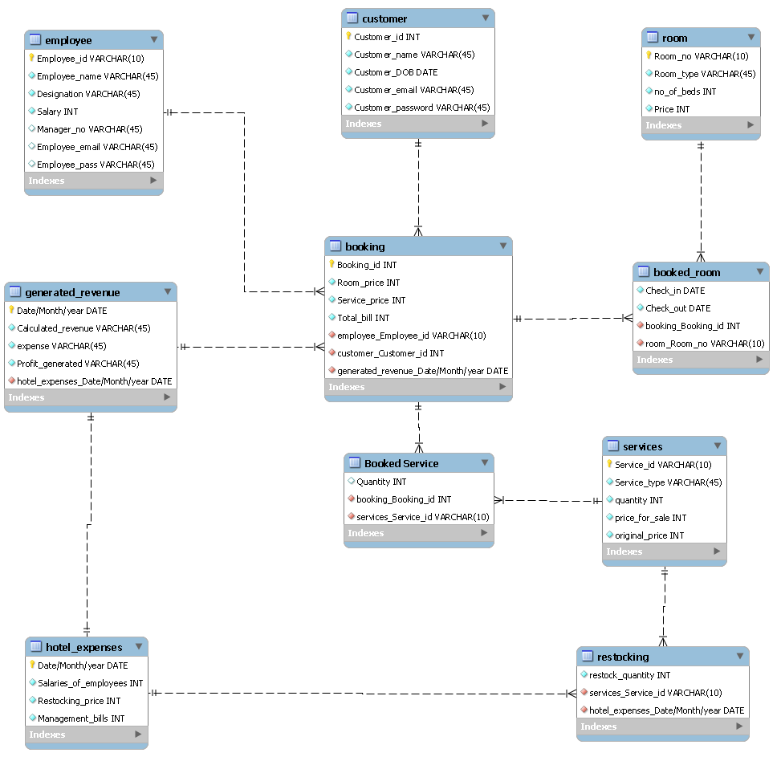

# Hotel Management System

## Overview
This project is a web-based hotel management system that allows users to book multiple rooms at once, order services, and view real-time updates of the hotel's status. The system is built using Flask, HTML, CSS, and JavaScript, and is connected to a MySQL database.

## Features
- Room booking: Users can book multiple rooms at once, choose the number of guests and the date of their stay.
- Service ordering: Guests can order various services, such as room service or laundry service.
- Admin view: The admin has a separate view of the system, which allows them to view real-time updates of the hotel's status.
- Front desk view: The front desk has a page where they can view and manage the services booked by the guests.

## Technologies used
- Flask: A web framework for Python, used for building the backend of the system.
- HTML, CSS, JavaScript: Used for building the frontend of the system.
- MySQL: Used for storing and retrieving data for the system.
- Flask Sessions: Used for managing user sessions in the system.

The complete normalized ERD is shown below

